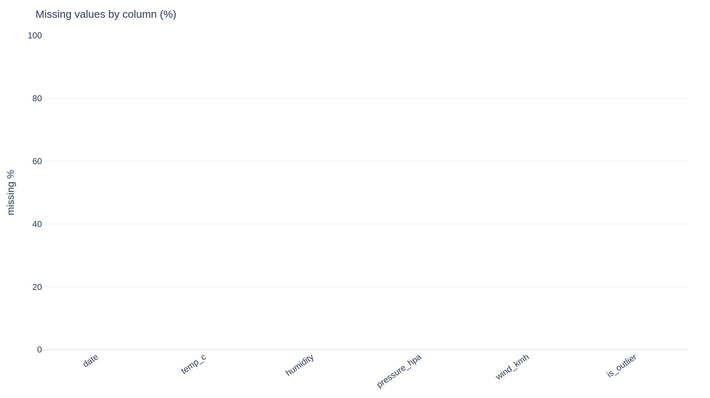
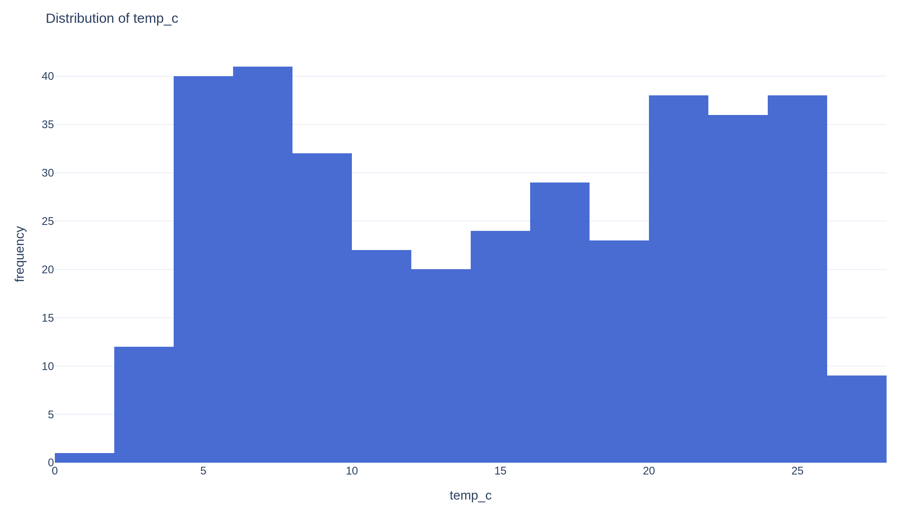
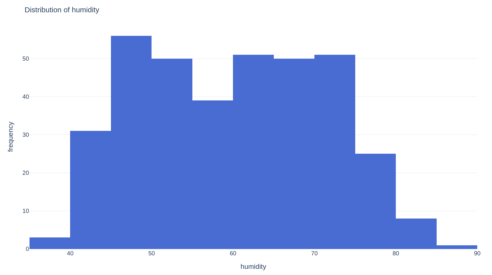
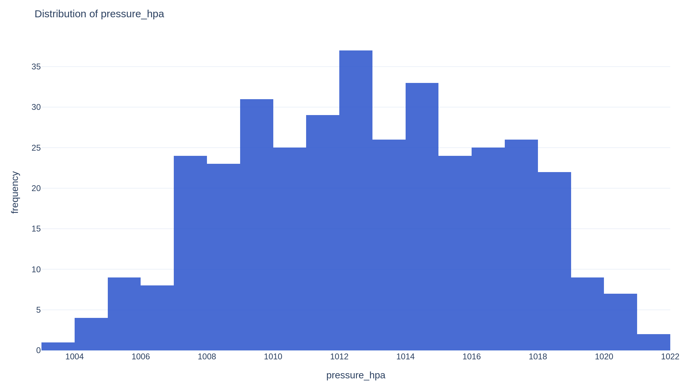
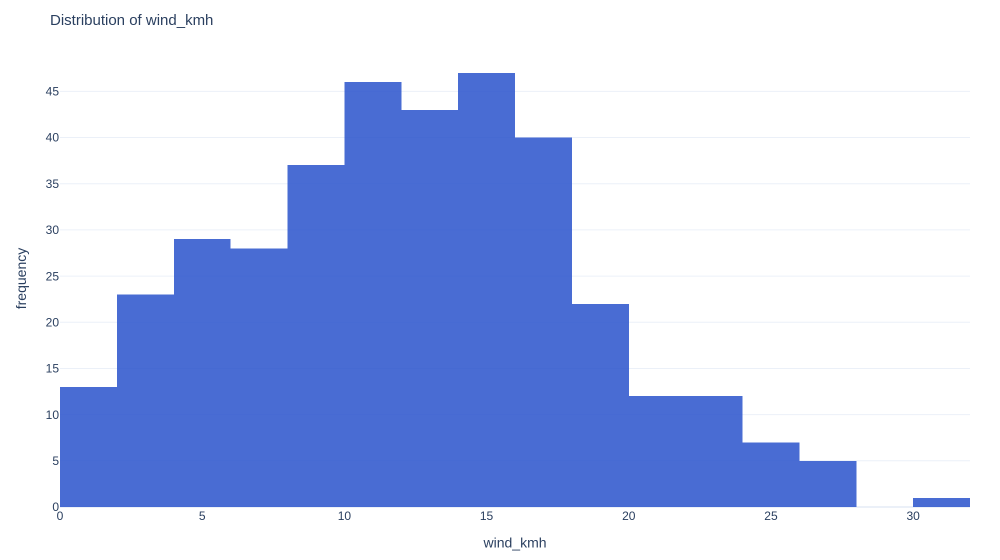
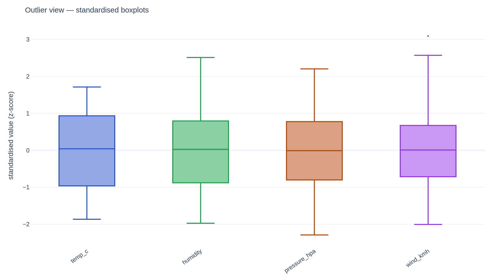
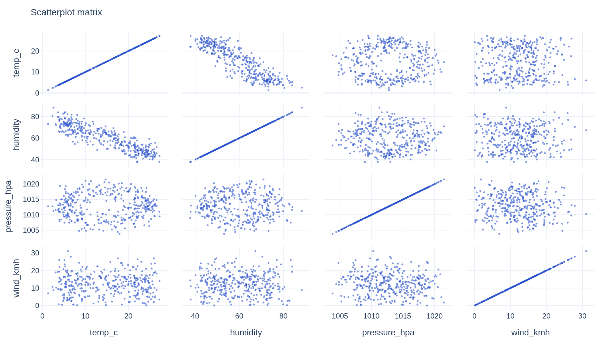
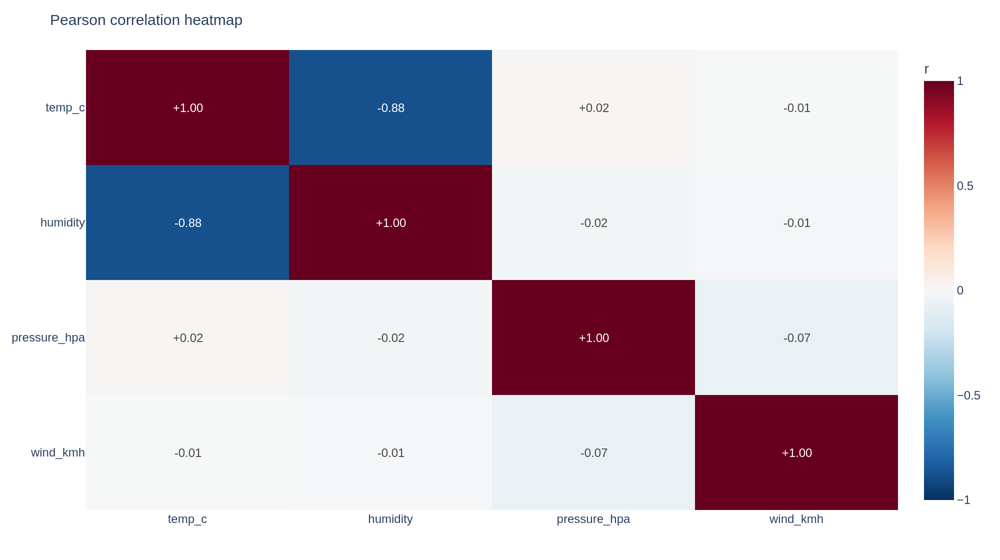

# Automated EDA Report — climate_demo.csv

*Source:* `examples/data/climate_demo.csv`  •  *Generated:* 2026-06-20 15:59:39 UTC  •  *Engine:* polars

## 1. Dataset Overview

- **Data-quality score:** 100.0/100  (completeness 100.0, validity 100.0, uniqueness 100.0)
- **Rows:** 365
- **Columns:** 6
- **In-memory size:** 7.2 KB
- **Duplicate rows:** 0

## 2. Data-Health Warnings

- ✅ No critical data-health issues detected.

## 3. Visualisations

















## 4. Pipeline Actions

### ingest
- Ingested CSV → 365 rows × 5 cols (15.0 KB in memory)

### standardize
- Stripped/collapsed whitespace on 1 text column(s)
- Parsed datetimes: ['date (%Y-%m-%d)']

### impute
- Time-series forward/backward fill applied to 4 numeric col(s)

### outliers
- Flagged 1 row(s) in 'is_outlier'

### downcast
- Downcast 4 column(s): 12.9 KB → 7.2 KB (saved 44.3%)

## 5. Column Profiles

| Column | Dtype | Kind | Non-null | Null % | Unique | Mean | Std | Min | Median | Max | Skew | Kurtosis |
|---|---|---|--:|--:|--:|--:|--:|--:|--:|--:|--:|--:|
| date | `Date` | datetime | 365 | 0.0 | 365 | — | — | — | — | — | — | — |
| temp_c | `Float32` | numeric | 365 | 0.0 | 365 | 14.85 | 7.256 | 1.318 | 15.15 | 27.27 | -0.01504 | -1.406 |
| humidity | `Float32` | numeric | 365 | 0.0 | 355 | 60.07 | 11.26 | 37.86 | 60.38 | 88.34 | 0.0757 | -1.014 |
| pressure_hpa | `Float32` | numeric | 365 | 0.0 | 365 | 1,013 | 3.936 | 1,004 | 1,013 | 1,022 | -0.01121 | -0.8424 |
| wind_kmh | `Float32` | numeric | 365 | 0.0 | 365 | 12.31 | 6.085 | 0.1049 | 12.36 | 31.12 | 0.1629 | -0.3478 |
| is_outlier | `Boolean` | boolean | 365 | 0.0 | 2 | — | — | — | — | — | — | — |

## 6. Correlation Highlights

_No feature pairs exceed the collinearity threshold._

## 7. Correlation Matrix (Pearson)

| | temp_c | humidity | pressure_hpa | wind_kmh |
|---|---|---|---|---|
| **temp_c** | +1.00 | -0.88 | +0.02 | -0.01 |
| **humidity** | -0.88 | +1.00 | -0.02 | -0.01 |
| **pressure_hpa** | +0.02 | -0.02 | +1.00 | -0.07 |
| **wind_kmh** | -0.01 | -0.01 | -0.07 | +1.00 |

## 8. Advanced Analysis

> **Statistical hygiene:** 12 tests/associations computed automatically; treat unadjusted p-values cautiously (multiple comparisons).

**Auto-specialisation:** time-series (90%)  |  auto-modules: inference, fda

- Time index 'date' detected → time-series handling enabled (ordered forward-fill, functional analysis of trajectories).

**Normality tests**

| Feature | n | Shapiro p | D'Agostino p | Jarque-Bera p | Anderson stat/crit(5%) | Verdict |
|---|--:|--:|--:|--:|--:|---|
| temp_c | 365 | 4.722e-12 | 0 | 2.965e-07 | 8.37 / 0.779 | Non-normal |
| humidity | 365 | 1.423e-06 | 4.97e-17 | 0.0003383 | 3.253 / 0.779 | Non-normal |
| pressure_hpa | 365 | 0.0005558 | 5.612e-08 | 0.004514 | 1.366 / 0.779 | Non-normal |
| wind_kmh | 365 | 0.02213 | 0.1439 | 0.1779 | 0.4954 / 0.779 | Normal |

**Multicollinearity (VIF)**

| Feature | VIF | Severity |
|---|--:|---|
| humidity | 4.42 | ok |
| temp_c | 4.42 | ok |
| wind_kmh | 1.01 | ok |
| pressure_hpa | 1.01 | ok |

**PCA** — components for 90% variance: 3; for 95%: 3

**Bootstrap 95% confidence intervals**

| Feature | Statistic | Estimate | 95% CI |
|---|---|--:|---|
| temp_c | mean | 14.85 | [14.08, 15.55] |
| humidity | mean | 60.07 | [58.95, 61.22] |
| pressure_hpa | mean | 1,013 | [1,012, 1,013] |
| wind_kmh | mean | 12.31 | [11.7, 12.95] |

**Significant correlations (Benjamini-Hochberg)**

| A | B | r | p | p (adj) |
|---|---|--:|--:|--:|
| temp_c | humidity | -0.879 | 4.135e-119 | 2.481e-118 |

_Caveats: p-values are exploratory and not corrected for the full garden of forking paths. Confidence intervals assume i.i.d. sampling; clustered/time-dependent data need block methods. Associations are not causal — confounders are not controlled here._

**Functional data analysis** (index `date`) — 4 curves × 365 points, smoothing: Savitzky-Golay (window=11, order=2); modes for 90% variance: 2; top-mode variance: 70%, 26%, 5%, 0%

**Robust location estimators**

| Feature | Mean | Geom | Harm | Trim 10% | Winsor 10% | Median | MAD | Huber |
|---|--:|--:|--:|--:|--:|--:|--:|--:|
| temp_c | 14.85 | 12.73 | 10.41 | 14.84 | 14.86 | 15.15 | 6.879 | 14.85 |
| humidity | 60.07 | 59 | 57.93 | 59.93 | 59.92 | 60.38 | 9.477 | 59.99 |
| pressure_hpa | 1,013 | 1,013 | 1,013 | 1,013 | 1,013 | 1,013 | 3.104 | 1,013 |
| wind_kmh | 12.31 | 10.11 | 5.534 | 12.19 | 12.17 | 12.36 | 4.095 | 12.2 |

**Spearman rank correlations**

| A | B | rho | p |
|---|---|--:|--:|
| temp_c | humidity | -0.880 | 1.044e-119 |

**Partial correlations**

| A | B | partial r |
|---|---|--:|
| temp_c | humidity | -0.880 |

**Best-fit distributions (AIC)**

| Feature | Best fit | AIC | BIC | KS p |
|---|---|--:|--:|--:|
| temp_c | weibull_min | 2,463 | 2,475 | 0.0006 |
| humidity | weibull_min | 2,790 | 2,802 | 0.0347 |
| pressure_hpa | weibull_min | 2,032 | 2,044 | 0.5045 |
| wind_kmh | weibull_min | 2,348 | 2,360 | 0.8637 |

**Time-series diagnostics**

| Series | ADF p | KPSS p | Stationary | Mann-Kendall | Period | Seasonal str. | Trend str. |
|---|--:|--:|---|---|--:|--:|--:|
| temp_c | 0.8715 | 0.01 | no | decreasing (0) | 7 | 0.163 | 0.971 |
| humidity | 0.6808 | 0.01 | no | increasing (0) | 7 | 0.209 | 0.85 |
| pressure_hpa | 0.6587 | 0.01 | no | no trend (0.7155) | 7 | 0.226 | 0.795 |
| wind_kmh | 0 | 0.1 | yes | no trend (0.5299) | None | — | — |

**Forecasts (next 12 steps)**

| Series | Model | Last | Next | Horizon end (95% CI) |
|---|---|--:|--:|---|
| temp_c | ETS(add trend) | 14.89 | 15.15 | 17.25 [14.42, 20.09] |
| humidity | ETS(add trend) | 64.87 | 61.03 | 59.25 [48.7, 69.8] |
| pressure_hpa | ETS(add trend) | 1,015 | 1,018 | 1,019 [1,015, 1,023] |
| wind_kmh | ETS(add trend) | 14.41 | 11.94 | 11.92 [0.0196, 23.82] |

**Multivariate:** Mahalanobis outliers 5; clusters 2 (silhouette 0.333); 2D PCA var 0.738

## 9. Configuration

```json
{
  "detection_sample_rows": 4096,
  "csv_null_values": [
    "",
    "na",
    "n/a",
    "nan",
    "null",
    "none",
    "nil",
    "-",
    "?",
    "#n/a"
  ],
  "downcast": true,
  "downcast_floats": true,
  "float32_rel_tolerance": 1e-06,
  "impute_numeric": "auto",
  "impute_categorical": "mode",
  "categorical_fill_value": "Unknown",
  "skew_threshold": 1.0,
  "detect_timeseries": true,
  "knn_neighbors": 5,
  "knn_max_rows": 20000,
  "outlier_methods": [
    "iqr"
  ],
  "outlier_action": "flag",
  "iqr_multiplier": 1.5,
  "zscore_threshold": 3.0,
  "iforest_contamination": "auto",
  "strip_whitespace": true,
  "parse_datetimes": true,
  "datetime_parse_min_success": 0.8,
  "standardize_categoricals": true,
  "categorical_case": "none",
  "parse_numeric_strings": true,
  "numeric_string_min_success": 0.9,
  "missing_warn_threshold": 0.2,
  "corr_threshold": 0.9,
  "high_cardinality_warn": 50,
  "skew_warn_threshold": 2.0,
  "make_charts": true,
  "export_png": true,
  "make_pdf": true,
  "make_json": true,
  "chart_max_numeric": 12,
  "chart_max_scatter_cols": 6,
  "chart_scatter_sample": 5000,
  "chart_top_categories": 15,
  "advanced": true,
  "target": null,
  "apply_transforms": false,
  "vif_warn": 10.0,
  "auto_specialize": true,
  "inference": true,
  "modeling": true,
  "fda": true,
  "extended_stats": true,
  "forecast": true,
  "forecast_horizon": 12,
  "use_transformer_embeddings": false,
  "embedding_model": "all-MiniLM-L6-v2",
  "streaming": false,
  "random_seed": 7,
  "verbose": false
}
```
